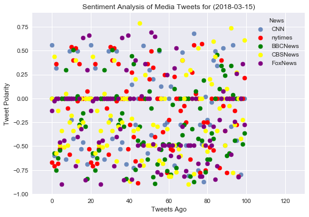

```python
# Assignment - Distinguishing Sentiments
```


```python
# Dependencies
import tweepy
import numpy as np
import pandas as pd
from datetime import datetime
import matplotlib.pyplot as plt
from matplotlib import style
style.use('seaborn')
#plt.style.use('seaborn')

# Import and Initialize Sentiment Analyzer
from vaderSentiment.vaderSentiment import SentimentIntensityAnalyzer
analyzer = SentimentIntensityAnalyzer()

# Twitter API Keys
from config import (consumer_key, 
                    consumer_secret, 
                    access_token, 
                    access_token_secret)

# Setup Tweepy API Authentication
auth = tweepy.OAuthHandler(consumer_key, consumer_secret)
auth.set_access_token(access_token, access_token_secret)
api = tweepy.API(auth, parser=tweepy.parsers.JSONParser())
```


```python
def get_result(target_user):
    #counter=1
    sentiments = []
    public_tweets = api.user_timeline(target_user)
   
    for tweet in public_tweets:
        results = analyzer.polarity_scores(tweet["text"])
        compound = results["compound"]
        pos = results["pos"]
        neu = results["neu"]
        neg = results["neg"]
        #tweets_ago = counter
        
        # Add sentiments for each tweet into an array
        sentiments.append({"Date": tweet["created_at"], 
                           "Compound": compound,
                           "Positive": pos,
                           "Negative": neu,
                           "Neutral": neg
                           })
        
        # Add to counter 
        #counter = counter + 1
        return sentiments
```


```python
# Target Account
target_user = "@CNN"

sentiments_res = get_result("@CNN")


# Convert sentiments to DataFrame
sentiments_pd = pd.DataFrame.from_dict(sentiments_res)
sentiments_pd.shape
```

    count:<built-in method count of list object at 0x0000025FD309F848>
    


    (1, 5)


```python
# Target Account
target_user = "@CNN"

# Counter
counter = 1

# Variables for holding sentiments
sentiments = []


# Loop through 5 pages of tweets (total 100 tweets)
for x in range(5):

    # Get all tweets from home feed
    public_tweets = api.user_timeline(target_user, page = x)

    # Loop through all tweets 
    for tweet in public_tweets:

        # Print Tweets
        # print("Tweet %s: %s" % (counter, tweet["text"]))
        
        # Run Vader Analysis on each tweet
        results = analyzer.polarity_scores(tweet["text"])
        compound = results["compound"]
        pos = results["pos"]
        neu = results["neu"]
        neg = results["neg"]
        tweets_ago = counter
        
        # Add sentiments for each tweet into an array
        sentiments.append({"Date": tweet["created_at"], 
                           "Compound": compound,
                           "Positive": pos,
                           "Negative": neu,
                           "Neutral": neg,
                           "Tweets Ago": counter})
        
        # Add to counter 
        counter = counter + 1

```


```python
# Convert sentiments to DataFrame
sentiments_pd = pd.DataFrame.from_dict(sentiments)
sentiments_pd.shape
```


    (100, 6)


```python
# Target Account
target_user = "@nytimes"

# Counter
counter = 1

# Variables for holding sentiments
sentiments1 = []


# Loop through 5 pages of tweets (total 100 tweets)
for x in range(5):

    # Get all tweets from home feed
    public_tweets = api.user_timeline(target_user, page = x)

    # Loop through all tweets 
    for tweet in public_tweets:

        # Print Tweets
        # print("Tweet %s: %s" % (counter, tweet["text"]))
        
        # Run Vader Analysis on each tweet
        results = analyzer.polarity_scores(tweet["text"])
        compound = results["compound"]
        pos = results["pos"]
        neu = results["neu"]
        neg = results["neg"]
        tweets_ago = counter
        
        # Add sentiments for each tweet into an array
        sentiments1.append({"Date": tweet["created_at"], 
                           "Compound": compound,
                           "Positive": pos,
                           "Negative": neu,
                           "Neutral": neg,
                           "Tweets Ago": counter})
        
        # Add to counter 
        counter = counter + 1

```


```python
sentiments_pd1 = pd.DataFrame.from_dict(sentiments1)
sentiments_pd1.shape
```


    (100, 6)


```python
# Target Account
target_user = "@BBCNews"

# Counter
counter = 1

# Variables for holding sentiments
sentiments2 = []


# Loop through 5 pages of tweets (total 100 tweets)
for x in range(5):

    # Get all tweets from home feed
    public_tweets = api.user_timeline(target_user, page = x)

    # Loop through all tweets 
    for tweet in public_tweets:

        # Print Tweets
        # print("Tweet %s: %s" % (counter, tweet["text"]))
        
        # Run Vader Analysis on each tweet
        results = analyzer.polarity_scores(tweet["text"])
        compound = results["compound"]
        pos = results["pos"]
        neu = results["neu"]
        neg = results["neg"]
        tweets_ago = counter
        
        # Add sentiments for each tweet into an array
        sentiments2.append({"Date": tweet["created_at"], 
                           "Compound": compound,
                           "Positive": pos,
                           "Negative": neu,
                           "Neutral": neg,
                           "Tweets Ago": counter})
        
        # Add to counter 
        counter = counter + 1

```


```python
sentiments_pd2 = pd.DataFrame.from_dict(sentiments2)
sentiments_pd2.shape
```


    (100, 6)


```python
# Target Account
target_user = "@CBSNews"

# Counter
counter = 1

# Variables for holding sentiments
sentiments3 = []


# Loop through 5 pages of tweets (total 100 tweets)
for x in range(5):

    # Get all tweets from home feed
    public_tweets = api.user_timeline(target_user, page = x)

    # Loop through all tweets 
    for tweet in public_tweets:

        # Print Tweets
        # print("Tweet %s: %s" % (counter, tweet["text"]))
        
        # Run Vader Analysis on each tweet
        results = analyzer.polarity_scores(tweet["text"])
        compound = results["compound"]
        pos = results["pos"]
        neu = results["neu"]
        neg = results["neg"]
        tweets_ago = counter
        
        # Add sentiments for each tweet into an array
        sentiments3.append({"Date": tweet["created_at"], 
                           "Compound": compound,
                           "Positive": pos,
                           "Negative": neu,
                           "Neutral": neg,
                           "Tweets Ago": counter})
        
        # Add to counter 
        counter = counter + 1

```


```python
sentiments_pd3 = pd.DataFrame.from_dict(sentiments3)
sentiments_pd3.shape
```


    (100, 6)


```python
# Target Account
target_user = "@FoxNews"

# Counter
counter = 1

# Variables for holding sentiments
sentiments4 = []


# Loop through 5 pages of tweets (total 100 tweets)
for x in range(5):

    # Get all tweets from home feed
    public_tweets = api.user_timeline(target_user, page = x)

    # Loop through all tweets 
    for tweet in public_tweets:

        # Print Tweets
        # print("Tweet %s: %s" % (counter, tweet["text"]))
        
        # Run Vader Analysis on each tweet
        results = analyzer.polarity_scores(tweet["text"])
        compound = results["compound"]
        pos = results["pos"]
        neu = results["neu"]
        neg = results["neg"]
        tweets_ago = counter
        
        # Add sentiments for each tweet into an array
        sentiments4.append({"Date": tweet["created_at"], 
                           "Compound": compound,
                           "Positive": pos,
                           "Negative": neu,
                           "Neutral": neg,
                           "Tweets Ago": counter})
        
        # Add to counter 
        counter = counter + 1

```


```python
sentiments_pd4 = pd.DataFrame.from_dict(sentiments4)
sentiments_pd4.shape
```


    (100, 6)


```python
plt.scatter(np.arange(len(sentiments_pd["Compound"])),
         sentiments_pd["Compound"], marker="o", linewidth=0.5,
         alpha=0.8, label="CNN")
plt.scatter(np.arange(len(sentiments_pd1["Compound"])),
         sentiments_pd1["Compound"], marker="o", linewidth=0.5, c= 'red', label="nytimes")
plt.scatter(np.arange(len(sentiments_pd2["Compound"])),
         sentiments_pd2["Compound"], marker="o", linewidth=0.5, c= 'green', label="BBCNews")
plt.scatter(np.arange(len(sentiments_pd3["Compound"])),
         sentiments_pd3["Compound"], marker="o", linewidth=0.5, c= 'yellow', label="CBSNews")
plt.scatter(np.arange(len(sentiments_pd4["Compound"])),
         sentiments_pd4["Compound"], marker="o", linewidth=0.5, c= 'purple', label="FoxNews")
# # Incorporate the other graph properties
now = datetime.now()
now = now.strftime("%Y-%m-%d")
plt.title("Sentiment Analysis of Media Tweets for ({})".format(now, target_user))
plt.ylabel("Tweet Polarity")
plt.xlabel("Tweets Ago")
plt.xlim(-10,130)
plt.legend(loc = "best", title='News')
plt.show()
```





```python
# Create plot
plt.plot(np.arange(len(sentiments_pd["Compound"])),
         sentiments_pd["Compound"], marker="o", linewidth=0.5,
         alpha=0.8)

# # Incorporate the other graph properties
now = datetime.now()
now = now.strftime("%Y-%m-%d %H:%M")
plt.title("Sentiment Analysis of Tweets ({}) for {}".format(now, target_user))
plt.ylabel("Tweet Polarity")
plt.xlabel("Tweets Ago")
plt.show()
```
